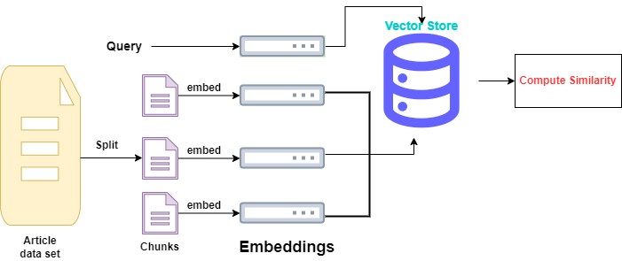
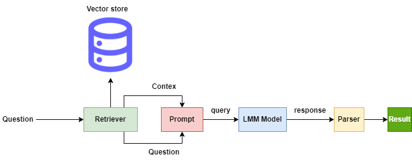

# RAG-Article-Retrieval-System
An article Retrieval System using chatGPT and LangChain for kaggle dataset '1300 Towards Data Science Medium Articles'. The system accomplishes efficient search in the articles and allow to ask question and give response using chatGPT.

**Article Retrieval System**



**Retrieval Augmented Generation with chatGPT**


## Setup
1. Create a virtural environment and install the required packages:
```
   $ python3 -m venv .venv 
   $ source .venv/bin/activate
   $ pip install -r requirements.txt
```
2. Create openai account and get your API key
3.Create a .env file with the following variable:
```
OPENAI_API_KEY = [Enter your API key]
```
## Sample operation
**Search Operation in the article**
call the search_article() function and give it your query.
```
query = "what is artificial general intelligence?"
search_article(query)


Output:
Query: what is artificial general intelligence?
Retrieved Documents: 4

Source Article Title: Artificial General Intelligence (AGI) Vs. Narrow AI

Text:  Vendors and theorists can promise the world, but it’s essential to differentiate between Artificial General Intelligence (AGI) and narrow AI in order to make informed decisions.

In simplest terms, all of the contemporary AI is narrow or weak AI. Even the smartest systems are not able to execute common sense comparable to human intelligence. While ...


Source Article Title: Artificial and Human Intelligence

Text:  Prescriptive Analytics is the area of Artificial Intelligence dedicated to prescribe best possible next actions. It relies on a set of techniques which I will illustrate using a simple and familiar problem everyone knows: packing luggage. My wife and kids might not know it, but they are using Business Rules (BR), Machine Learning (ML), and Decision...


Source Article Title: Describing AI

Text:  Companies are investing millions of pounds to develop Artificial Intelligence (AI) technology. Many people use that AI technology daily to make their lives easier. But search Google for images of “Artificial Intelligence”, and you’ll be faced with a sea of glowing, bright blue, connected brains. The imagery used to illustrate AI is a far cry from t...


Source Article Title: The relationship between Biological and Artificial Intelligence

Text:  Intelligence can be defined as a predominantly human ability to accomplish tasks that are generally hard for computers and animals. Artificial Intelligence [AI] is a field attempting to accomplish such tasks with computers. AI is becoming increasingly widespread, as are claims of its relationship with Biological Intelligence. Often these claims are...
```
```
query = "What are embeddings?"
search_article(query)

output
Query: What are embeddings?
Retrieved Documents: 4

Source Article Title: Word Embeddings for NLP

Text:  Word Embeddings for NLP

In this article, we will understand how to process text for usage in machine learning algorithms. What are embeddings and why are they used for text processing?

word2vec and GloVe word embeddings

Natural Language Processing(NLP) refers to computer systems designed to understand human language. Human language, like English...


Source Article Title: Entity embedding using t-SNE

Text:  We have been discussing some of the possible ways to embed categorical features: Kernel PCA and Spectral Encoding. The goal of such embedding is to map categorical features to vectors in a low dimensional space. The advantage is this mapping dramatically reduce overfitting, compared to 1-hot encoding. However we can lose information and make the le...


Source Article Title: Categorical Embedding and Transfer Learning

Text:  Introduction

A lot of machine learning algorithms can not deal with categorical variables directly unless they are converted to numbers. However, the problem is that their performance varies significantly by the way these categorical variables are encoded into numbers. This article explores the problem of categorical encoding and gives a glimpse o...


Source Article Title: A Beginner’s Guide to Word Embedding with Gensim Word2Vec Model

Text:  1. Introduction of Word2vec

Word2vec is one of the most popular technique to learn word embeddings using a two-layer neural network. Its input is a text corpus and its output is a set of vectors. Word embedding via word2vec can make natural language computer-readable, then further implementation of mathematical operations on words can be used to d...
```

## RAG Q&A with chatGPT
call the rag_app() funtion and give it your question ang chatGPT answers based on the article data set.
**Example**
```
query = "what is artificial general intelligence?"

output:
Query: what is artificial general intelligence?


Answer: Artificial general intelligence (AGI) refers to a type of artificial intelligence that possesses the ability to perform tasks that are generally considered to be difficult for both computers and animals. AGI aims to simulate human-like intelligence, such as reasoning, problem-solving, and abstract thinking.
```
```
query = "what is prompt engineering"
rag_app(query)

output:
Query: What is prompt engineering?


Answer: No content related in the knowledge base.
```


